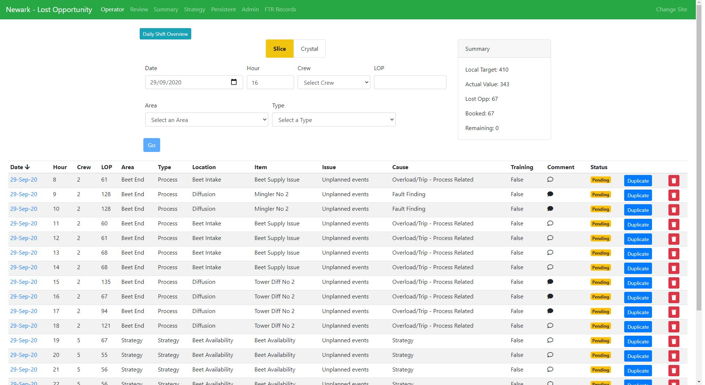
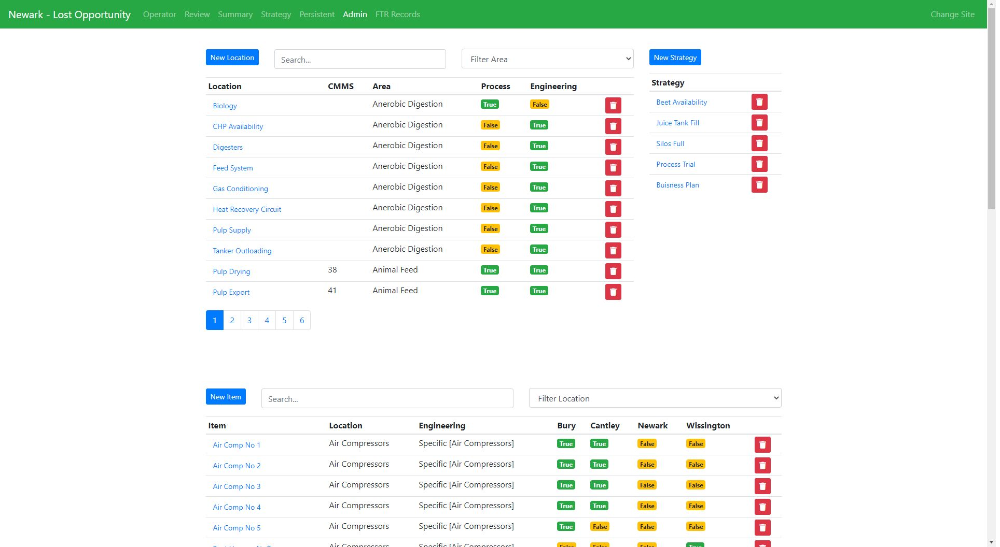
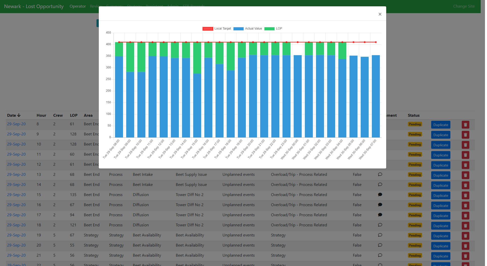
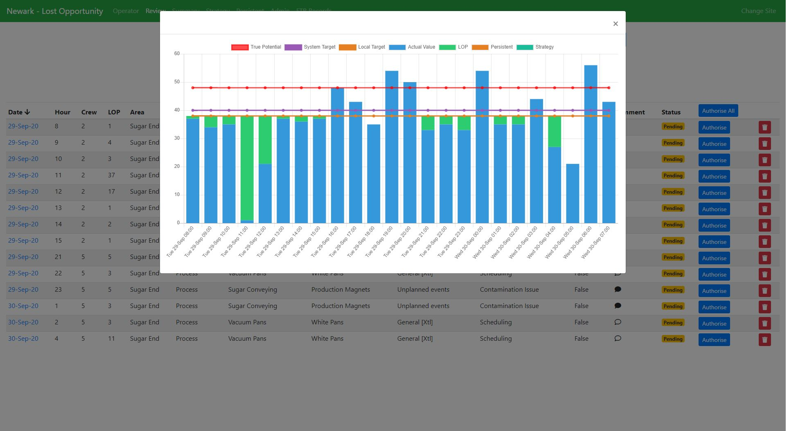
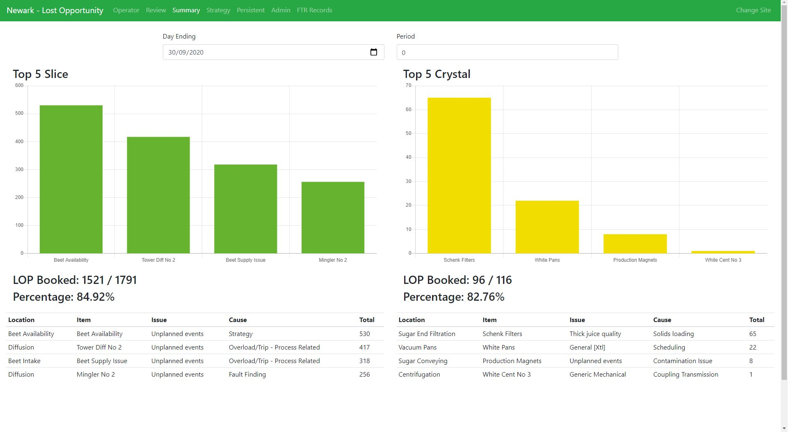

The business requirement for this project was to be able to track the reasons why the factory wasn't able to hit its production targets. It records performance at each of the factories, for each product stream. Factories can range from 2 main product streams, up to 5 that need a level of reporting.

With these kinds of projects, there is always a risk of typographical errors which can present false data when reported on, so that posed a challenge on how to get the right level of detail while maintaining data integrity.

### Targets

Targets are set via the factory control system and that data then needed to be interfaced with each hour, to record the targets and the actual production value. A simple subtraction gives the _Lost Opportunity_ for that hour, which can then be booked against. As one of the factory goals is to maintain stability, over shooting the target shouldn't cancel out the under performance of previous hours.

The interface to fetch the production data and targets is a simple script that loops each site and loss, and maps the correlating control system code to the correct loss.

To keep the system simple for booking, the production figures are rounded to integers, to prevent fiddly decimals needing to be booked. Each hour can have multiple bookings assigned, up to the total Lost Opportunity.

### Library

The first categorisation that needs to be made is the type of Loss. Process, Engineering or Strategy. This gives a broad overview as to where most problems are coming from.

To overcome the challenge of data integrity, a data hierarchy was put into place; Area, Location, Item, Issue and cause. One area can have multiple Locations, one location can have multiple items and so on. The operator can then select down into detail what the root cause was for each hour. This can then be reported on to increasing levels of detail.

Admins are able to maintain the library themselves to allow changes to be made to bookings and naming.

### Persistent Bookings

Some issues can persist for a number of days, either in factory or within some kind of _Strategy_. One way this is handled is by having a Duplicate button on each record to quickly allow the same complex data point to be booked to the next hour. This was as simple fix that was a big win for end users, as it saved a huge amount of time.

Multiple targets are set for each loss, one for operators and one for the True Potential (Flat out run rate). To save booking the same information every hour, an automatic booking process exists that operates using percentages, rather than absolute values. When the targets are ingested into the system, the persistent bookings are also booked if set by the process manager.

### Reviewing

The expectation is for 100% of the Lost Opportunity to be booked each day, and for the data to be booked to the correct root cause. All data is reviewed by the shift supervisor and they have to authorise each hours booking to double check the bookings.

Charts are available to both operators and supervisors. This allows them to have a quick visual on which hours may not have been booked, so they can quickly finish the booking for their shift.

A summary page also exists to provide a Top 5 chart over a time period, along with overall booking information and a data table for all bookings.

### Other Applications

This style of reporting can be implemented to many different industries, by tracking different performance measurements and having a different library of bookings to select from. This project has also utilised a different style of booking. The target is set based on the volume dumped, rather than performance against target. This allows bookings to be made against waste, instead of poor performance.

## Talking Tech

### Tech Stack

The web application is built in [React.js](https://reactjs.org/), and utilises [Bootstrap](https://getbootstrap.com) and [Chart.js](https://www.chartjs.org/) for design and UI elements.

The backend API is written in [Node.js](https://nodejs.org), and is tied to a [SQL Server](https://www.microsoft.com/en-gb/sql-server/sql-server-2019) database using [Sequelize](https://sequelize.org/) for Modelling.

The full end to end solution was implemented by myself, with support from the project team on the library and

### Backend Automation

The Target and persistent booking system is also written in [Node.js](https://nodejs.org), and runs on a windows server using Task Scheduler. It's a very basic approach but it works.

### Security

This application is hosted internally within a corporate network on a secure server, so security and traceability wasn't a primary concern. Logins are still implemented to allow role based access, individual site access and control over who can book, but all roles are generic and protected by a shared password for each role and site.
